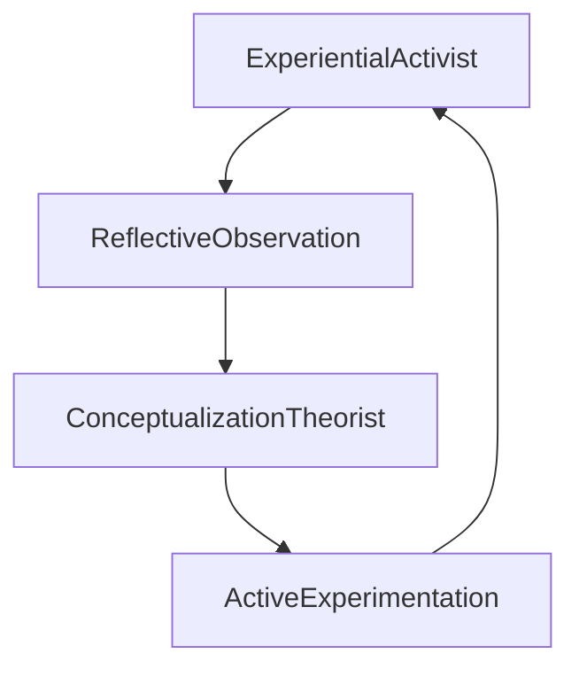
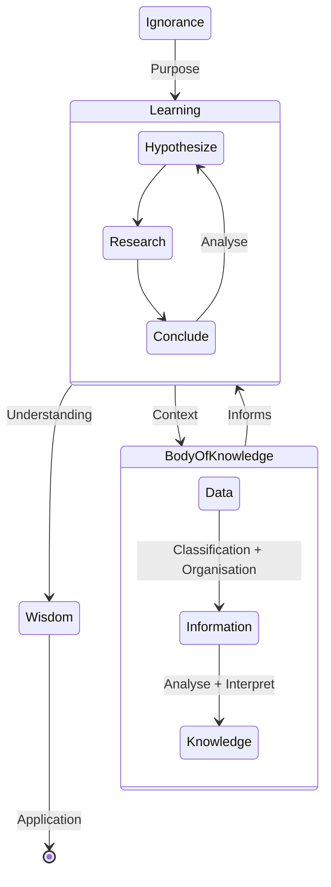

#   The Acquisition of Knowledge

##	Preamble – Meandering Through Some History
Most of this discussion is the result having to apply some thought, way back circa 2004, to creating a Data Encyclopaedia and what purpose such a thing would serve other than as a dumping ground for metadata definitions.

Our initial conclusions were that its main purpose is to:
-	As with any other encyclopaedia provide information relevant information focussed on a defined subject area.
-	Organise the information in such a way that it is easily discoverable by someone that wants to learn about the subject area without necessarily knowing anything about it.
-	Provide multiple viewpoints
-	Provide extensive cross-references to encourage exploration of the encyclopaedia beyond answering the initial questions.

At some point I also came across the word “Extelligent” - a term coined by Ian Stewart and Jack Cohen, in their book “Figments of Reality”, to describe “collective” knowledge that lives outside of an individual but is available to all individuals that form part of that collective.

This was all well and good but nearly all the published work on “collective knowledge” just focussed on building database solutions the store the underlying information in or “tagging” data with some predefined classification scheme so that it could be found later.
Pretty much none of it was about the actual process of learning or the acquisition of knowledge.

This subsequently led me on to thinking about the “Acquisition Of Knowledge” itself and the process of learning that someone would go through. We then thought about whether it was possible to formalise it as a set of state transitions and processes – an initial version of that was created in 2006.
Subsequently, following a conversation in 2009 with some UK Government contacts, Simon & I were asked to put a proposal together for an Energy Performance Knowledgebase  for the UK Department of Energy & Climate Control to collect together all of the data related to domestic and commercial energy usage.

This led me to start thinking about the process of assembling a body of knowledge from raw data and what features this particular knowledgebase would need to support.
This resulted in a second version of the state chart being published in 2009.

Finally, after another beery evening conversation with Simon, we hit on the current version of the Acquisition Of Knowledge state-chart shown here incorporating both the state of the Leaner and, now additionally, the state of the Body Of Knowledge itself.

So, what we’re describing here is the Process of Learning as a set of discrete states that a Learner may have at any particular point in time, and a set of transformations that may be applied to those States in order to achieve another State.

##	The Acquisition of Knowledge

According to some experts (e.g. John Dewey, Experience & Education, 1938) learning forms a virtuous circle of observation and experimentation something like this:

However, although this is a good abstraction (at least in my opinion it is) of the internal learning activity, it does not explain (a) why someone might want to learn something and (b) [TDC][ASM1.1]
Instead, the process of learning could be described as a transition from the state of Ignorance to the state of Wisdom by learning about a Body of Knowledge . That is:

Where:
-	Ignorance is the state of not knowing something about a particular Subject Area i.e. I have a question that needs to be answered (a Purpose) and undertake an activity to find those answers.
-	Wisdom is the Learning State that is achieved by having Information that is understood by the Learner and satisfies the desired outcome of the Purpose.

Everything else between these two states can be described as the State Of Learning which, coupled with the Dewey Process of Learning , gives us this:

As with any state transition model there are stimuli that need to occur in order to complete the transition from one state to another. In this case the various stimuli for each transition could be considered to be:
-   **Purpose**, given awareness of Ignorance, is the process of formulating the objectives and goals that are set as the reason for learning. Without Purpose the Process of Learning is unfocussed and directionless.
Purpose could be regarded as a Pre-Condition to the domain but makes more sense (certainly in the case of Human Learning) to regard it as a (existential) state transition that prepares the Learner for the process of Learning.
-   **Hypothesise** is the act of formulating additional questions based on what is so far understood that require further research to be carried out . The exit condition is a lack of willingness or reason to hypothesize i.e. Purpose has been satisfied and the necessary Knowledge has been acquired.
-   **Analyse & Interpret** are the various analysis methods that are applied to the Research in order to form one or more Conclusions.
-   **Understanding** is the exit condition from any state of Learning – “I had a Purpose, I learnt some stuff, I think I understand the answers therefore I’m done.”
-   **Application**  is the process of applying the Wisdom that has been gained from Learning  outside of the Learning domain. In this context “Experience” could be equated to a final state a “Wisdom” i.e. recognising potential applicability of Knowledge may be a side-effect of having Wisdom rather than a transformation towards Wisdom.

So, in a very basic sense, this is the process of learning and the acquisition of knowledge from a personal perspective.

##	Extelligence & Collective Learning

**Intelligence** , in terms of “what do I know and how do I make best use of it”, is primarily internalised

Through normal collaboration and exchange of ideas we easily get to this:

However we need to go a step further to create a shared Body of Knowledge

To move to an Extelligent Collective Learning environment requires a more detailed understanding of how:
•	Some parts of the Process of Learning may be carried out by different members of the collective.
•	The collective Body Of Knowledge needs to meet the individual learning requirements of each member of the collective.

###	The Body Of Knowledge
Each State indicates the relative position of a Learner with respect to a particular Learning Domain. The States that may exist are:
•	Data is basic Learning State where the Learner possesses the raw and unformatted facts and observations that are available or may be collected within the Learning Domain.
•	Information is the Learning State where the Learner can provide Information about what already exists within the Learning Domain and is able to retrieve that Information in an organised and structured manner.
•	Knowledge is achieved when we can deduce and / or predict the likely answer to a question by recognising it’s similarity to other data / information / knowledge we possess without having to re-enter the Learning Domain.
The transformations that take place are:
“Classification + Organisation” is the basic process of describing data by classifying the various data-items and organising them into data hierarchies. This is the initial task because in order to extract Knowledge the Data must first be organised into a framework that is understandable and well structured.

Of course, the transformations are recursive because any individual element within the Learning Domain could be the subject of its own individual Learning Domain  and any number of Learning Domains can be combined to form larger Learning Domains. We can think of this as Knowledge Aggregation & Decomposition - Aggregation is how the body of knowledge continually grows and integrates with related bodies of knowledge and Decomposition is how we divide a Learning Domain into smaller domains in order to make a problem tractable.
Things to think about:
•	Original thought always follows this process and it applies to both Intelligent and Extelligent Entities.
•	Are the Transformations instances of things that have achieved Wisdom?
I could argue that we are applying particular transformations because we predictively know that the transformation will produce a particular outcome based on previous transformations of a similar nature applied to similar data. This predictive aspect is one of the characteristics of our definition of Wisdom.
As a minimum the Transformations are Knowledge so should also be included in the Learning Domain even if we don’t subsequently apply them to attain Wisdom.
The things that are of interest to us here are the Transformations that occur rather than the States that can be achieved.
Of the three transformations within the Learning Domain the Hypothesis transformation is a “free thought” process that is very difficult to quantify in procedural terms, i.e. we don’t know enough about free-thought to be able emulate it in an artificial construct.
Assertion (not sure what level yet): Artificial Intelligence may not be achievable because true Intelligence requires the ability to Learn which would require the ability to Hypothesis and, in turn, would require Free Thought. So Artificial Intelligence would require the creation of Artificial Free Thought.
However, the other two transformations can be quantified and, much more importantly, can be applied to Reuters business processes to produce a body of knowledge that would underpin a Learning Domain. For example:
•	A Pre-Production / Collection process is generally performing a “Classification + Organisation” transformation because we are gathering data from areas outside of our domain (our data suppliers) and transforming that data into Information by applying our frameworks to that data. Thus because it is neatly organised and conforms to our perception of data quality we now have Information.
•	A Persistent Analytic function is a “Understanding + Interpretation” transformation because it is accessing Information and deriving Knowledge from the Information Set that is not inherently obvious from the individual instances of Information.
For example Price per Earnings ratio requires two Facts (the Price and the Earnings) to calculate it and the result is not directly derivable from either Fact in isolation. To be a valid transformation the resulting Knowledge must always be consistent over time when provided with consistent Information.
However, although this is Learning it is Learning of the Intelligent rather than the Extelligent kind. That is we have freely available Facts at varying States of Learning from the perspective of different Learners.
[ASM:	I wonder what this says about our society where our preferred method of learning in schools is of the Intelligent (competitive) rather than Extelligent (co-operative) kind. Or am I misunderstanding Extelligent here?]
Unfortunately, much of Reuters Knowledge offering was at the Intelligent end of the spectrum i.e. lots of little pockets of knowledge distributed across many individual entities whereas, from the collective perspective we wanted to move towards the Extelligent end of the spectrum, i.e. a common and shared understanding of the body of knowledge that transcends the existence of any individual.

##	Some Central Problems To Be Addressed
###	The “Pragmatists” Experiential Process of Learning
Learning from experience and driven by the maxim “Always make new mistakes” or, alternatively, “Always repeat success”.
There’s little formal process around this other than try something and learn from the results.

See what works  Understand why it works  Record that it works  Identify Patterns in What Works  Record the Patterns
###	The “Meaning of Meaning” is subjective not objective
The first problem (because it is the single most important problem) encountered with utilizing a shared Body of Knowledge is the “Meaning of Meaning” problem.
Essentially, whenever a Statement is made, there are three distinct meanings that always present
•	The Intended Meaning is what the Contributor of the Statement intended for it to mean at the time that they made the Statement.
•	The Interpreted Meaning
•	The Actual Meaning

###	Truth is just a “Degree of Assertion” and not the “Absolute Truth”
The big problem with establishing the truth of a statement is that it’s nearly impossible to prove that something is absolutely true only that it definitely isn’t true.
###	Assumptions & Assertions
This is where we start getting into Assumptions & Assertions where:
•	Assumptions are statements made by some other party that we believe to be true but have not independently verified for ourselves.
•	Assertions are statements made by ourselves that we believe to be true and have some empirical  evidence for believing.
Obviously one persons Assertion is another persons Assumption

###	“Facts are not Opinions and Opinions are not Facts”
All knowledge, because it is an interpretation of the available facts, is merely opinion and opinions, no matter how well grounded they are on facts, are not themselves facts until they are independently verified.
However, even though they are not facts, the opinions are information because even if the opinion is incorrect, inaccurate or just plain wrong it is still something that helps to inform the production of other knowledge.
This is an important distinction that needs to be recognised.
###	“Exposition is not always an explanation”

###	“Clear and precise are mutually exclusive states”

###	“What something appears to be is not always what it is”

##	A Repository of Knowledge
Of course if we’re going to acquire all this knowledge then we need somewhere to store it so that it can be retrieved and referenced at some later point in time. “Intelligent” Human Beings have mind and memory to do that but an “Extelligent” organisation needs a shared “Repository of Knowledge”
This, to bring me full-circle back to the origination point, is the purpose of what we generally call a Data Encyclopaedia or Metadata Repository.
It gathers together the Knowledge that is available within the organisation into a central location and then makes that knowledge available to any members of the Extelligent Collective who have a purpose.
It also provides a central location for Individuals to contribute more Data / Information / Knowledge to the “Body of Facts”.
We can then make that Knowledge available to new members of the Extelligent Collective who, with a defined set of objectives and goals (Purpose) can interrogate the Data Encyclopedia to acquire Knowledge relating to their Purpose.
The by-product is that as a collective we achieve Extelligence because key knowledge belongs to the Collective and not the Individual. (A benefit is we no longer worry about people falling under buses or otherwise cease to exist in whichever reality we collectively inhabit.)
This is much more useful than a Data Dictionary because a dictionary only organises and structures things so it only provides Information. Without the context and associations necessary to Understand & Interpret the contents a Data Dictionary cannot provide Knowledge. A Data Encyclopedia does.
##	Scope a Repository of Knowledge
###	What it should include
Glossary of Terms
Dictionary
Thesaurus
Relationships between all of those things
###	What it should not include

###	What it might include

