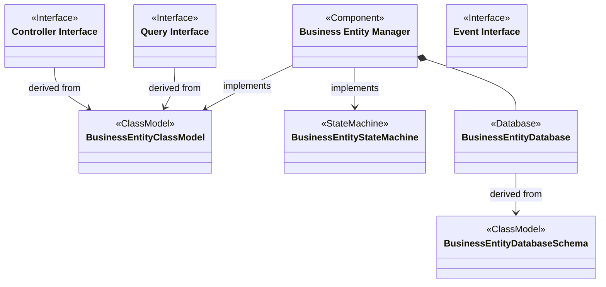

#   Domain Component Structure

The Business Entity Component:

- ... realizes two Interfaces
  - ... a single Controller Interface that provides operations for external users to change the state of the managed Business Entity
  - ... a single Query Interface that provides find and retrieval operations for external consumers of the managed Business Entity
- ... and implements a specific Data Domain Class Model
- ... and optionally uses many Query Interfaces provided by other Data Domains
- ... and manages the persistence of the Business Entity in a Business Entity Database
- ... which is also derived from the Data Domain Class Model

[Back](../index.md) [Home](../index.md)
